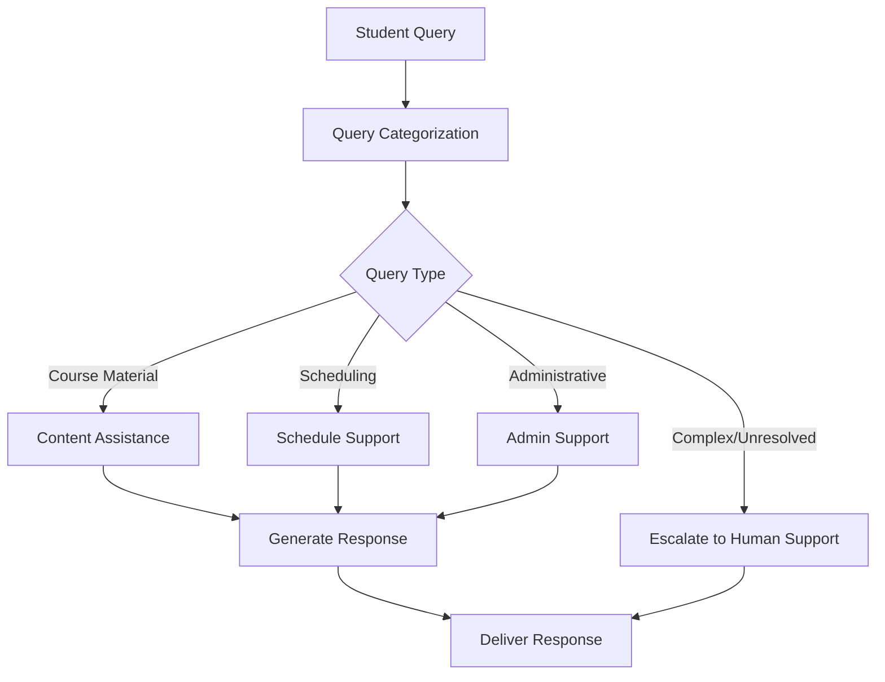

Here's a formatted `README.md` for your EdTech Student Support Agent project:

---

# Intelligent EdTech Student Support Agent with LangGraph  

## 📌 **Overview**  
This project demonstrates how to create an intelligent student support agent using **LangGraph**, a powerful tool for building complex language model workflows. The agent assists with course material inquiries, scheduling, and administrative questions, enhancing student engagement and streamlining support for educational institutions.  

---

## 🎯 **Motivation**  
In today's evolving educational landscape, efficient and accurate student support is crucial. Automating the initial stages of student interaction can significantly reduce response times, improve access to information, and enhance the overall learning experience. This project showcases how advanced language models and graph-based workflows can be combined to create a sophisticated support system tailored for educational platforms.  

---

## 🚀 **Key Components**  

1. **State Management:** Defines and manages each student interaction's state using `TypedDict`.  
2. **Query Categorization:** Classifies student queries into categories such as:
   - **Course Material**  
   - **Scheduling**  
   - **Administrative**  
3. **Content Assistance:** Provides accurate information or resources based on the student's query.  
4. **Scheduling Support:** Assists with class schedules, reminders, and conflict resolution.  
5. **Response Generation:** Crafts clear, helpful responses tailored to different types of queries.  
6. **Escalation Mechanism:** Refers complex or unresolved queries to human support staff.  
7. **Workflow Graph:** Utilizes LangGraph to create a flexible and extensible workflow for managing student inquiries.  

---

## 🛠️ **Method Details**  

### 1. **Initialization**  
   Set up the environment and import necessary libraries.

### 2. **State Definition**  
   Define a structure to hold query information, category, and generated responses using `TypedDict`.

### 3. **Node Functions**  
   Implement functions for:  
   - Query categorization  
   - Content retrieval  
   - Scheduling assistance  

### 4. **Graph Construction**  
   Use **StateGraph** to define the workflow, adding nodes and edges to represent each step of the support process.

### 5. **Conditional Routing**  
   Route queries based on their type and complexity:  
   - Simple queries receive automated responses.  
   - Complex queries are escalated to human support.  

### 6. **Workflow Compilation**  
   Compile the graph into an executable application.

### 7. **Execution**  
   Process student queries through the workflow and return actionable results.

---

## 🧩 **Architecture Workflow**  

---

## 📈 **Benefits**  

- **Efficient Support:** Reduces response times with automated initial interactions.  
- **Enhanced Learning Experience:** Provides accurate and timely assistance to students.  
- **Scalability:** Easily extendable to handle more query types or integrate with existing systems.  

---

## 🔧 **Customization**  
- **Add Custom Categories:** Expand the query categorization module.  
- **Integrate with LMS:** Connect to learning management systems or student databases.  
- **Enhance Response Logic:** Customize responses to suit specific institutional needs.  

---

## 🤝 **Contribution**  
Contributions are welcome!  
1. Fork the repository.  
2. Create a new branch (`git checkout -b feature-branch`).  
3. Commit your changes (`git commit -m "Add new feature"`).  
4. Push to the branch (`git push origin feature-branch`).  
5. Open a Pull Request.  

---

## 📜 **License**  
This project is licensed under the [MIT License](LICENSE).  

---

## ✨ **Conclusion**  
This project highlights the power and flexibility of **LangGraph** for creating AI-driven workflows in educational platforms. By combining natural language processing capabilities with a structured graph-based approach, we’ve built a student support agent capable of efficiently handling diverse inquiries. This framework can be extended to various domains, demonstrating the potential of orchestrating language models to solve multi-step challenges.  

---  
